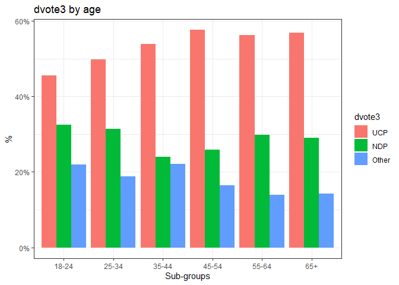

jbsMisc
================

## Installation

Run the command:

    remotes::install_github("jb-santos/svyEffects")

You’ll need the `{remotes}` package to do so, which can be installed by
running:

    install.packages("remotes")

## Simple crosstab using `ctab()`

Create a survey design object. (These functions also work on vanilla
data frames).

``` r
library(tidyverse)
library(survey)
data("ab")
absvy <- svydesign(~1, data = ab, weights = ~weight)
```

Generate the crosstab using `ctab()`.

``` r
library(jbsMisc)
votetbl <- ctab(absvy, yvar = "dvote3", xvar = "region")
votetbl
#> # A tibble: 12 × 4
#> # Groups:   region [4]
#>    dvote3 region       n   pct
#>    <fct>  <fct>    <dbl> <dbl>
#>  1 UCP    Calgary    224 0.586
#>  2 NDP    Calgary     97 0.254
#>  3 Other  Calgary     61 0.160
#>  4 UCP    Edmonton   143 0.402
#>  5 NDP    Edmonton   136 0.382
#>  6 Other  Edmonton    77 0.216
#>  7 UCP    Other      208 0.619
#>  8 NDP    Other       74 0.220
#>  9 Other  Other       54 0.161
#> 10 UCP    Total      576 0.536
#> 11 NDP    Total      307 0.286
#> 12 Other  Total      191 0.178
```

The output is in long, or “tidy” format and lends itself well to
plotting with `ggplot()`.

``` r
library(ggplot2)
ggplot(votetbl) +
  aes(x = region, y = pct, fill = dvote3) +
  geom_bar(stat = "identity")
```

<!-- -->

``` r
library(ggplot2)
ggplot(votetbl) +
  aes(x = region, y = pct, fill = dvote3) +
  geom_bar(stat = "identity", position = position_dodge())
```

<!-- -->

## Multiple crosstabs (aka “stub-and-banner” tables) using `ctabs()`

We can generate stub-and-banner crosstabs that cross-tabulate a single
“dependent” (or row) variable against multiple “independent” (columns)
variables using the `ctabs()` function. This is similar to the output in
many polling reports (the generation of which is what led me to write
these functions).

Calculate the crosstabs. Multiple column variables can be specified by
naming multiple variables within the argument `xvars = c()`.

The output is a list object with the class `ctabs`.

``` r
library(jbsMisc)
votetbl <- ctabs(absvy, yvar = "dvote3", xvars = c("region", "female", "age"))
names(votetbl)
#> [1] "Summary" "Total"   "region"  "female"  "age"
```

The first slot `$Summary` is the multiple crosstab table.

``` r
votetbl
#> # A tibble: 3 × 13
#>   dvote3 Total Calgary Edmonton Other Male  Female `18-24` `25-34` `35-44`
#>   <chr>  <chr> <chr>   <chr>    <chr> <chr> <chr>  <chr>   <chr>   <chr>  
#> 1 UCP    54%   59%     40%      62%   57%   50%    46%     50%     54%    
#> 2 NDP    29%   25%     38%      22%   26%   31%    32%     31%     24%    
#> 3 Other  18%   16%     22%      16%   17%   19%    22%     19%     22%    
#> # … with 3 more variables: `45-54` <chr>, `55-64` <chr>, `65+` <chr>
```

The second slot `$Total` contains the marginal frequency distribution of
the row variable.

``` r
votetbl[[2]]
#> # A tibble: 3 × 4
#>   dvote3 Total     n   pct
#>   <fct>  <fct> <dbl> <dbl>
#> 1 UCP    Total   576 0.536
#> 2 NDP    Total   307 0.286
#> 3 Other  Total   191 0.178
```

Subsequent tables contain a long- or tidy-format crosstab between the
row variable and the respective column variable.

``` r
votetbl[[4]]
#> # A tibble: 6 × 4
#> # Groups:   female [2]
#>   dvote3 female     n   pct
#>   <fct>  <fct>  <dbl> <dbl>
#> 1 UCP    Male     313 0.568
#> 2 NDP    Male     144 0.261
#> 3 Other  Male      94 0.171
#> 4 UCP    Female   263 0.503
#> 5 NDP    Female   163 0.312
#> 6 Other  Female    97 0.186
```

### Plotting multiple crosstabs

There is a `plot()` method included for the objects outputted by
`ctabs()`.

``` r
plot(votetbl)
```

<!-- -->

The `plot()` function can take a few arguments to modify the default
plots.

`plot.ctabs(x, tblno = 1, dodge = FALSE, txt = FALSE)`

- `tblno =` selects which table in the `ctabs` list object to plot.
- `dodge =` whether bars should be “clustered” using `position_dodge()`.
  By default, they are stacked using `position_stack()`.
- `txt =` should text labels be added to graph.

``` r
plot(votetbl, dodge = TRUE, txt = TRUE)
```

<!-- -->

`plot()` is a wrapper for `ggplot()`, so you can add additional options
using `+ ...`.

``` r
plot(votetbl, dodge = FALSE, txt = TRUE) +
  scale_fill_manual(values = c("#184484", "#f37221", "#bbbbbb")) +
  labs(title = "Alberta vote intention",
       subtitle = "Decided/leaning voters only, n=1,074",
       y = "",
       x = "Sub-group",
       fill = "Party",
       caption = "Janet Brown Opinion Research / Trend Research") +
  theme_classic()
```

<!-- -->

### Plotting other tables in `ctabs()` objects

The second slot has the marginal frequencies.

``` r
plot(votetbl, 2, dodge = TRUE) + theme_bw()
```

<!-- -->

Slots 3 onward each have a plot of the row variable against the
respective column variable.

``` r
plot(votetbl, 5, dodge = TRUE) + theme_bw()
```

<!-- -->

## Testing columns for significant differences using `testcols()`

This function tests columns for significant differences. You can also
obtain Holm-corrected p-values for multiple comparisons using the
argument `adj.p = TRUE`.

``` r
votetbl <- ctabs(absvy, yvar = "dvote3", xvars = c("region", "educ"))
votetbl_tests <- testcols(votetbl)
```

``` r
votetbl_tests
#> $region
#> # A tibble: 9 × 5
#> # Groups:   Response [4]
#>   Response Stat  Calgary Edmonton Other
#>   <chr>    <chr> <chr>   <chr>    <chr>
#> 1 "UCP"    n     "224"   "143"    "208"
#> 2 " "      pct   "59%"   "40%"    "62%"
#> 3 " "      sig   "B"     "AC"     "B"  
#> 4 "NDP"    n     "97"    "136"    "74" 
#> 5 " "      pct   "25%"   "38%"    "22%"
#> 6 " "      sig   "B"     "C"      "B"  
#> 7 "Other"  n     "61"    "77"     "54" 
#> 8 " "      pct   "16%"   "22%"    "16%"
#> 9 " "      sig   ""      ""       ""   
#> 
#> $educ
#> # A tibble: 9 × 6
#> # Groups:   Response [4]
#>   Response Stat  NoPSE SomePSE Bachelors Graduate
#>   <chr>    <chr> <chr> <chr>   <chr>     <chr>   
#> 1 "UCP"    n     "115" "274"   "136"     "46"    
#> 2 " "      pct   "68%" "61%"   "45%"     "31%"   
#> 3 " "      sig   "CD"  "CD"    "ABD"     "ABC"   
#> 4 "NDP"    n     "27"  "92"    "112"     "76"    
#> 5 " "      pct   "16%" "20%"   "37%"     "51%"   
#> 6 " "      sig   "CD"  "CD"    "ABD"     "ABC"   
#> 7 "Other"  n     "26"  "85"    "52"      "27"    
#> 8 " "      pct   "15%" "19%"   "17%"     "18%"   
#> 9 " "      sig   ""    ""      ""        ""      
#> 
#> attr(,"ctabs.test")
#> [1] TRUE
#> attr(,"yvar")
#> [1] "dvote3"
#> attr(,"ylevs")
#> [1] "UCP"   "NDP"   "Other"
#> attr(,"siglabs")
#> attr(,"siglabs")[[1]]
#> [1] "A" "B" "C"
#> 
#> attr(,"siglabs")[[2]]
#> [1] "A" "B" "C" "D"
```

## Nicely-formatted crosstabs

The `ctabs_format()` function takes the output of `testcols` and
consolidates all crosstabs (with significance testing) into a single
crosstab.

``` r
votetbl_fmt <- ctabs_format(votetbl_tests)
votetbl_fmt
#> # A tibble: 10 × 9
#>    Response Stat  Calgary Edmonton Other NoPSE SomePSE Bachelors Graduate
#>    <chr>    <chr> <chr>   <chr>    <chr> <chr> <chr>   <chr>     <chr>   
#>  1 ""       ""    "(A)"   "(B)"    "(C)" "(A)" "(B)"   "(C)"     "(D)"   
#>  2 "UCP"    "n"   "224"   "143"    "208" "115" "274"   "136"     "46"    
#>  3 " "      "pct" "59%"   "40%"    "62%" "68%" "61%"   "45%"     "31%"   
#>  4 " "      "sig" "B"     "AC"     "B"   "CD"  "CD"    "ABD"     "ABC"   
#>  5 "NDP"    "n"   "97"    "136"    "74"  "27"  "92"    "112"     "76"    
#>  6 " "      "pct" "25%"   "38%"    "22%" "16%" "20%"   "37%"     "51%"   
#>  7 " "      "sig" "B"     "C"      "B"   "CD"  "CD"    "ABD"     "ABC"   
#>  8 "Other"  "n"   "61"    "77"     "54"  "26"  "85"    "52"      "27"    
#>  9 " "      "pct" "16%"   "22%"    "16%" "15%" "19%"   "17%"     "18%"   
#> 10 " "      "sig" ""      ""       ""    ""    ""      ""        ""
```

The `ctabs_kbl()` function is a wrapper function for `kable()` and
prints publication-ready crosstabs in HTML and LaTeX formats.

By using the argument `xvarnames = c()`, you can specify custom names
for the independent variables.

    ctabs_kbl(votetbl_fmt, xvarnames = c("Region", "Education"))
